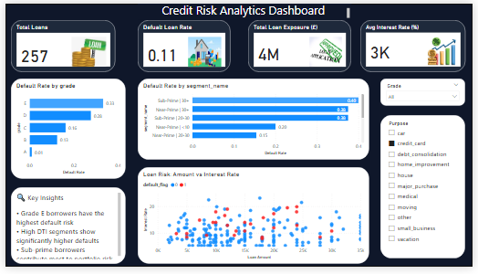

# Credit Risk Analytics Dashboard

This project analyses loan data to understand borrower behaviour and identify high-risk segments using SQL and Power BI.

## 📊 Project Overview

The goal of this project is to analyse lending data and identify factors influencing loan default risk.

## 🛠 Tools Used

- Excel (data cleaning)
- MySQL (data transformation & analysis)
- Power BI (dashboard & visualisation)

## 📈 Key Features

- Default rate analysis
- Credit grade risk comparison
- Borrower segmentation (DTI, income bands)
- Loan amount vs interest rate analysis

## 💡 Key Insights

- Lower credit grades show higher default rates
- High debt-to-income borrowers are more likely to default
- Risk is concentrated in sub-prime borrower segments

## 📸 Dashboard Preview

## 📁 Project Structure
